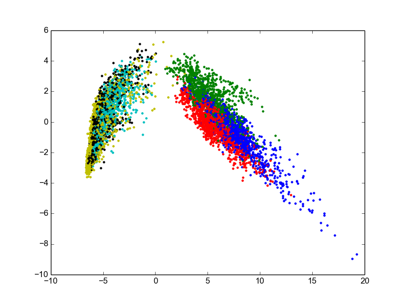

# RoboticaUVic-PR-week5
UVic Robotics Master. Pattern Recognition Homework 3

## Instructions

Fork this repository and write code to complete the assignments. When
executed, your code must print the answers to the questions in each
section, alongside the results that led to these conclusions. Module
*textwrap* can be used to format long paragraphs of text and make them
look nicer. An IPython notebook is an acceptable alternative to a
plain python program.

First upload the completed assignment to the course Moodle for
grading; then, correct all the issues marked by the teacher and push it
to GitHub for the final evaluation.

This is a personal assignment, please complete it **individually**. 

## K-Means

- **Q1** Implement the K-Means algorithm. The K-Means technique is an
iterative method to find the best K cluster centers of a set of data
according to the reconstruction error (i.e. accumulated distances from
the real points to their assigned centroids. Each iteration, the
algorithm computes the assignemnt of each point to the closest
centroid, and then recomputes the centroids based on the points that
have been assigned to them.  

 > Here is the pseudocode for the K-Means algorithm:  
 > 1) Initialize the *K* cluster centers *C* to some random values **(1)** or, alternatively, to *K* random points in the dataset.  
 > 2) Initialize the cluster assignments *Y* to the nearest cluster of each data point.  
 > 3) While Y changed during the last iteration do:  
 > 4)   Y_i = nearest_centroid(X_i, C) # assign each point to the nearest centroid.  
 > 5)   C = recompute_centroids(Y_i, X_i) # recompute each centroid as the mean of the points assigned to it.  
 > 6) Return C #Final stable centroids.   
 > **(1)** To avoid degenerate solutions, make sure that the random values are in the range taken by the components of the data set vectors.  
 > *Nearest_centroid* and *recompute_centroids* have to compute respectively:   
 >  &nbsp;&nbsp;&nbsp;   

- **Q2** Try the implemented K-Means algorithm with K=3 in the first
two dimensions of the iris dataset, so you can visualize it. Then try
it with the full four-dimensional vectors and report the MSE for each
cluster and globally. Optional: Compare how far are the clusters from the
actual center of each class (i.e. how well the clusters predict the classes).

## Extra

- Download the [**Human Activity Recognition Using Smartphones Dataset**](http://archive.ics.uci.edu/ml/datasets/Human+Activity+Recognition+Using+Smartphones) and experiment on it using PCA and K-Means (or even the classification techniques from last week, if you feel like it). 

 